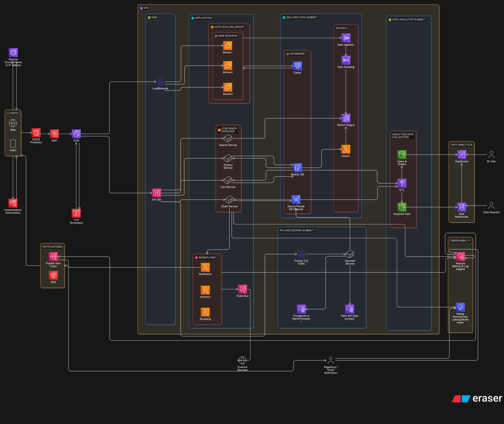

# E-Commerce App AWS Cloud Architecture 

## Description 

This repository provisions a highly available, multi-tier AWS infrastructure using segregated subnet layers for core services, big-data pipelines, and PCI-DSS compliance.

## Architecture Overview

> **Note:** you can find the diagram code for eraser.io in [code](./eraser-io.txt)

## Prerequisites

* Terraform CLI (`>= 1.5.0`)
* AWS CLI configured with appropriate administrator deployment role credentials.

## Workspace Initialization
To initialize local state backend tracking and download required cloud provider plugins:
```bash
terraform init 
```

## Modules Utilities 

### VPC 
This module provisons the core network infrastructure, it is split into 5 subnet tiers each spread across 2 AZs:
- **Public tier** 
- **Private tier**
- **Data tier** 
- **Data analytics tier** 
- **PCI tier**

### Edge 
This module is the first layer of the architecture, everything must pass throught it to reach the internal services in the application, it manages all public facing AWS infrastructure sitting outside the VPC: **WAF**, **CloudFront**, **Route53** and **S3** for static assets

### Routing
This module is responsible for provisionning the outboud internet connectivity for the public subnet tier: 
- An Internet Gateway
- A public route table with a default route, 
- The associations binding each public subnet to that table
Any resource that need inbound/outbound internet access in the VPC like the **ALB** or the **IGW** much pass through it

### Compute 
This module provisions the application compute layer: 
- A publicly exposed **ALB** 
- An **ECS Fargate** cluster running 4 microservices
- An **EC2 ASG** for background worker nodes

### Database
Provisions the stateful data layer: 
- **PostgreSQL RDS** instance for transactional data 
- **DynamoDB** table for flexible **NoSQL** storage 
- **Redis ElastiCache** replicaiton group for session cashing

### Security
Provisions all cross-cutting security primitives: 
- Security Groups controlling network traffic accross tiers
- **IAM** roles for **ECS**
- **Lambda** workloads
- **Cognito** user pool 

### Integration
This module acts as the serverless engine room of the platform, orchestrating: 
- Public application traffic 
- Backend business logic 
- Asynchronous event workflows 
It decouples core microservices and provides a highly available, fault-tolerant integration layer that connects frontend requests to private backend tiers

### Observability
This module acts as the monitoring, logging, and alerting control center for the platform's infrastructure. 
It establishes real-time operational visibility and automated health-tracking safeguards to ensure service reliability, performance tracing, and rapid incident response

### Analytics Search
This module establishes the platform's high-throughput big data ingestion pipeline and real-time application search engine.
It decouples high-volume analytical processing and application text search queries from production transaction databases, ensuring optimal performance, business intelligence capacity, and data warehousing isolation

## Modifications Notice 
If you find anything missing, please consider opening an issue and mention it on the fly, alongside the reason for the request.
